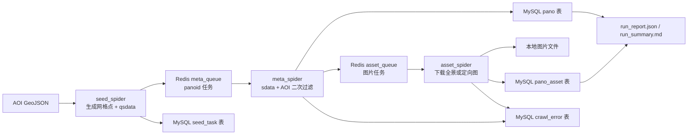

# 街景数据采集系统设计与实现说明

这份文档用于说明 `street_view_crawler` 的系统设计、核心实现、工程取舍和可追问细节。它面向爬虫、数据采集、数据工程相关岗位的技术面试场景，重点解释为什么这样设计、每个组件解决什么问题、当前实现有哪些边界，以及后续可以怎样继续演进。

## 1. 项目定位

`street_view_crawler` 是一个 AOI 驱动的街景数据采集系统。用户提供一个 GeoJSON 格式的目标区域，系统会在区域内生成采样点，调用百度街景相关接口发现街景 `panoid`，再抓取街景元数据和图片资产，最后将结构化结果、图片文件、运行日志和统计报告统一落盘。

这个项目不是一个简单的 `requests` 脚本。它把采集过程拆成了多个阶段，并引入 `Scrapy`、`Redis`、`MySQL` 和 `Docker Compose`，目标是解决真实采集任务里常见的几个问题：高并发请求、任务拆分、去重、持久化、运行状态追踪、失败记录、重复运行安全，以及结果可审计。

当前系统的核心能力包括：

- 按 AOI 多边形自动生成采样网格。
- 使用百度 `qsdata` 接口将采样点映射为候选 `panoid`。
- 使用百度 `sdata` 接口获取街景元数据，并用返回坐标做 AOI 二次过滤。
- 支持全景图下载，也支持按相对方向生成多张定向视图。
- 使用 Redis list/set 实现阶段间任务队列和去重。
- 使用 MySQL 保存任务、采样点、街景记录、图片资产和错误记录。
- 每次运行输出 `data/`、`logs/`、`reports/`，并生成 JSON 与 Markdown 报告。
- 支持多 worker 图片下载和三阶段流水线执行。
- 支持基于街景元数据邻接关系生成连续采样线 GeoJSON。

## 2. 技术栈与职责边界

系统使用的主要组件如下。

| 组件 | 当前用途 | 选择原因 |
| --- | --- | --- |
| Python 3.12 | 主开发语言 | 生态成熟，适合爬虫、数据处理和工程脚本 |
| Scrapy | 前两阶段网络请求调度，部分阶段承载 worker 生命周期 | 原生支持异步并发、重试、日志和统计 |
| Redis | 业务队列、去重集合、阶段完成标记 | 轻量、快、适合在多进程 worker 之间共享任务状态 |
| MySQL | 持久化任务状态、采样点、pano、asset、error | 结构化数据清晰，便于查询和展示 |
| Docker Compose | 本地统一拉起 MySQL、Redis、crawler | 降低环境配置成本，便于复现 |
| Pillow | 图片解码、拼接、保存 | 全景瓦片合并和图片格式处理 |
| requests | 图片阶段同步下载 | 图片下载和拼图流程较重，当前实现以直观可控为主 |

这里有一个需要讲清楚的点：当前项目没有使用 `scrapy-redis`。Redis 在本项目里传递的是业务任务，例如 `panoid` 任务和图片任务，而不是 Scrapy 的 Request 调度队列。这个设计让队列内容、幂等键和阶段边界更清楚，也更贴合“街景采集流水线”的业务模型。代价是需要自己实现队列生命周期、去重和退出条件。

## 3. 总体架构

系统主链路可以理解为三段流水线。



一次任务的产物目录固定为：

```text
runs/<job_id>/
  data/
    images/
    cache/
  logs/
  reports/
    runtime_status.json
    run_report.json
    run_summary.md
    stages/
```

这种目录结构的好处是每次运行都有独立上下文。图片、日志、报告和阶段统计都能通过同一个 `job_id` 找回来，方便排查问题，也方便后续做性能对比。

## 4. 任务配置与运行入口

配置由 `src/streetview_crawler/config.py` 负责加载。系统会先读基础配置，再叠加本地或 Docker 配置，最后叠加具体任务配置。

主要配置文件包括：

| 文件 | 作用 |
| --- | --- |
| `configs/base.yaml` | 默认采样间距、图片模式、并发数、Redis/MySQL 默认连接 |
| `configs/local.yaml` | 本地开发时连接 `127.0.0.1:3307` 与 `127.0.0.1:6379` |
| `configs/docker.yaml` | 容器内连接 `mysql:3306` 与 `redis:6379` |
| `configs/*.yaml` | 具体任务配置，例如 AOI 路径、采样间距、图片模式 |

典型全景任务配置：

```yaml
job:
  name: aoi_test_full_10m
  aoi_path: inputs/aoi_test.geojson

sampling:
  grid_spacing_m: 10.0

image:
  mode: panorama
```

CLI 入口位于 `src/streetview_crawler/cli.py`。常用命令包括：

```powershell
streetview-crawler submit-job --job-config configs/example_job.yaml
streetview-crawler run-job --job-config configs/example_job.yaml
streetview-crawler status --job-id <job_id> --show-content
streetview-crawler watch --job-id <job_id>
streetview-crawler latest-report --show-content
```

在 Docker 中运行时，一般使用：

```powershell
docker compose up -d mysql redis crawler
docker compose exec crawler python -m streetview_crawler.cli run-job --job-config configs/aoi_test_full_10m.yaml
```

`crawler` 容器默认以 `tail -f /dev/null` 常驻，真正的任务通过 `docker compose exec crawler ...` 发起。这意味着 Docker Desktop 里不一定能看到 crawler 的完整业务日志，因为业务日志主要写入 `runs/<job_id>/logs/`。

## 5. 三阶段采集流程

### 5.1 Seed 阶段：从 AOI 到 panoid

`seed_spider` 位于 `src/streetview_crawler/spiders/seed_spider.py`。这个阶段的输入是 AOI，多边形来自任务配置中的 `job.aoi_path`。它的主要逻辑是：

1. 读取 AOI。
2. 将 AOI 边界转换到百度墨卡托米制坐标系。
3. 按 `sampling.grid_spacing_m` 生成错位网格点。
4. 将每个点转换回 WGS84，经 `aoi_covers` 判断是否真的落在 AOI 内。
5. 对有效点调用百度 `qsdata` 接口。
6. 如果返回 `panoid`，写入 `seed_task`，并推入 Redis `meta_queue`。

这里使用错位网格，而不是简单矩形行列点，是为了让采样覆盖更均匀。当前默认间距来自 `configs/base.yaml`，目前为 `10.0m`。如果任务配置覆盖了 `sampling.grid_spacing_m`，以任务配置为准。

`qsdata` 的作用是“给定一个百度坐标点，找到附近街景”。它只能回答点附近有没有街景，不能直接返回一个 AOI 内的完整街景集合。因此系统必须先在 AOI 内播种，再靠密集点位去发现街景。

Seed 阶段会写入 `seed_task` 表。这个表既是采样点记录，也是后续排查采样覆盖和命中情况的重要依据。

### 5.2 Meta 阶段：从 panoid 到有效街景记录

`meta_spider` 位于 `src/streetview_crawler/spiders/meta_spider.py`。这个阶段从 Redis `meta_queue` 中消费 `panoid` 任务，调用百度 `sdata` 接口获取街景元数据。

Meta 阶段的关键不是“拿到元数据就入库”，而是做 AOI 二次过滤。原因是 Seed 阶段命中的 `panoid` 只是“采样点附近的街景”，这个街景本身未必落在 AOI 内。系统会从 `sdata` 返回的 `X/Y` 原始坐标中转换出 WGS84 坐标，再用 `aoi_covers` 判断真实 pano 坐标是否在 AOI 内。

只有通过二次过滤的记录才会写入 `pano` 表。写入字段包括：

- `job_id`
- `panoid`
- `seed_index`
- `seed_lng` / `seed_lat`
- `lng` / `lat`
- `heading_deg`
- `move_dir_deg`
- `north_dir_deg`
- `raw_meta_json`

`raw_meta_json` 会保留原始元数据，方便后续重新解析道路关系、时间线、邻接关系或其他字段。这一点在数据采集系统里很重要，因为下游需求经常变化。如果只存当前用到的字段，后续补分析时可能需要重新请求接口。

Meta 阶段还会根据配置生成图片任务。全景模式下，一个有效 `panoid` 生成一个 panorama 任务；定向图模式下，会根据 `direction`、`count`、`step_deg` 和 `fov` 生成多张视角图任务。

### 5.3 Asset 阶段：从图片任务到本地资产

`asset_spider` 位于 `src/streetview_crawler/spiders/asset_spider.py`。这个阶段从 Redis `asset_queue` 中消费图片任务，并将结果写入 `runs/<job_id>/data/images/`。

全景图使用百度 `pdata` 瓦片接口下载。当前配置中 `panorama.zoom=4`，对应 `PANORAMA_TILE_SHAPE[4] = (4, 8)`，也就是 32 个瓦片。系统会逐块下载、解码，再用 Pillow 拼成一张完整全景图。

定向图使用 `pr3d` 接口下载。系统会根据道路方向计算目标 `heading`。例如 `direction=right` 时，会在道路前进方向基础上偏移 90 度。如果请求的 heading 失败，会按 `fallback_delta_deg` 在左右范围内尝试邻近 heading。

Asset 阶段当前没有完全走 Scrapy 的异步 Request 模型，而是在线程/进程 worker 内使用 `requests.Session` 同步下载。这是一个务实取舍：图片下载涉及多瓦片请求、Pillow 解码、拼图、文件写入和哈希计算，用直观同步逻辑更容易保证正确性。为了提升吞吐，系统通过多个 `asset_spider` worker 进程并发消费同一个 Redis 队列。目前 `configs/base.yaml` 中 `asset.worker_processes=6`。

每个图片资产会写入 `pano_asset` 表，包含：

- `job_id`
- `panoid`
- `asset_type`
- `asset_spec`
- `rel_path`
- `format_ext`
- `width` / `height`
- `file_hash`
- `status`
- `error_message`

`file_hash` 使用 SHA-256 计算，用于文件内容校验和重复结果排查。

## 6. Redis 设计

Redis 逻辑集中在 `src/streetview_crawler/services/queue.py`。它的职责不是做最终存储，而是保存运行时的短状态。

当前使用的 key 主要包括：

| Key | 类型 | 作用 |
| --- | --- | --- |
| `job:{job_id}:meta_queue` | list | 等待抓取 `sdata` 的 panoid 任务 |
| `job:{job_id}:asset_queue` | list | 等待下载的图片任务 |
| `job:{job_id}:meta_seen` | set | meta 任务去重 |
| `job:{job_id}:asset_seen` | set | asset 任务去重 |
| `job:{job_id}:seed_done` | string | seed 阶段完成标记 |
| `job:{job_id}:meta_done` | string | meta 阶段完成标记 |
| `job:{job_id}:asset_done` | string | asset 阶段完成标记 |

队列使用 Redis list，消费使用 `BLPOP`。去重使用 Redis set，典型逻辑是先 `SADD`，如果返回 0 说明已经存在，就不再入队。

Meta 任务的去重键是 `panoid`。Asset 任务的去重键是：

```text
panoid:asset_type:asset_spec
```

这个键设计保证了同一个 pano 可以同时拥有多个 asset，例如一个 panorama 和多个 directional view，但同一个 asset 规格不会重复入队。

阶段完成标记用于流水线退出判断。因为当前 `run-job` 会同时启动 seed、meta、asset 三个阶段，如果下游 worker 只因为队列暂时为空就退出，会出现上游还没来得及继续生产任务、下游却提前结束的问题。因此 meta 阶段退出必须同时满足：

- seed 阶段已经写入 `seed_done`
- `meta_queue` 为空
- 连续空轮询达到阈值

Asset 阶段同理，必须等 meta 阶段完成且 `asset_queue` 清空后才能退出。

## 7. MySQL 数据模型

MySQL 初始化脚本位于 `docker/mysql/init/001_schema.sql`。当前主库是 `streetview`，包含五张核心表。

`crawl_job` 保存一次任务的全局状态。它记录 `job_id`、任务名、配置快照、任务状态、起止时间和报告路径。配置快照是关键字段，因为它保证了后续能知道当时到底用什么 AOI、什么采样间距、什么图片模式跑出来这批结果。

`seed_task` 保存 AOI 播种点。它记录采样点坐标、命中的 `panoid` 和状态。常见状态包括 `queued`、`discovered`、`no_hit`、`outside_aoi`、`meta_error`、`done`、`error`。

`pano` 保存最终确认有效的街景记录。它以 `(job_id, panoid)` 做唯一键，避免同一次任务内重复写入同一个街景点。

`pano_asset` 保存图片资产记录。它以 `(job_id, panoid, asset_type, asset_spec)` 做唯一键，避免重复图片记录。这个唯一键是图片阶段幂等的核心。

`crawl_error` 保存错误。错误按 `job_id`、`stage`、`error_kind`、`request_key`、`payload_json` 记录，方便后续按任务、阶段和错误类别聚合分析。

当前数据库层由 `src/streetview_crawler/services/db.py` 封装。写入采用 `INSERT ... ON DUPLICATE KEY UPDATE`，这让任务具备“重复执行时不重复插入”的基本幂等能力。

## 8. 幂等、去重与可重复运行

系统目前实现的是“幂等可重跑”，不是严格意义上的完整断点续跑。

幂等体现在几个层面：

- Redis `meta_seen` 保证同一 `panoid` 不重复进入 meta 队列。
- Redis `asset_seen` 保证同一图片规格不重复进入 asset 队列。
- MySQL `pano` 表通过 `(job_id, panoid)` 唯一键去重。
- MySQL `pano_asset` 表通过 `(job_id, panoid, asset_type, asset_spec)` 唯一键去重。
- 图片阶段保存前会检查目标文件是否存在，存在则更新资产记录并跳过下载。

这里需要诚实说明边界。当前系统还没有实现“中断后自动从数据库精确恢复 Redis 队列”的完整逻辑。如果任务中断，可以通过相同配置重新跑，依靠数据库唯一键和文件存在检查减少重复写入，但 seed 阶段仍可能重新生成采样点并重新请求部分接口。后续如果要做更完整的断点续跑，可以增加：

- 从 `seed_task` 中恢复未完成的 meta 任务。
- 从 `pano` 与 `pano_asset` 中恢复缺失或失败的 asset 任务。
- 给任务状态增加 `pending/running/success/error/retrying` 更明确的状态机。
- 给失败任务增加 `next_retry_at` 与最大重试次数。

面试中如果被问“是不是精确一次”，合理回答是：不是。当前系统采用的是更现实的 `at-least-once + 幂等写入`。分布式采集系统里追求严格 exactly-once 成本很高，本项目通过业务唯一键和重复写保护保证最终结果不重复。

## 9. 并发模型与性能优化

当前系统有两类并发。

第一类是 Scrapy 内部并发。`seed_spider` 和 `meta_spider` 会通过 Scrapy 调度多个 HTTP 请求。并发数由配置控制：

```yaml
spiders:
  seed:
    concurrent_requests: 16
  meta:
    concurrent_requests: 12
  asset:
    concurrent_requests: 8
```

第二类是多 worker 进程并发。`run-job` 会为每个阶段启动一个或多个 Scrapy 进程。当前默认：

```yaml
spiders:
  seed:
    worker_processes: 1
  meta:
    worker_processes: 1
  asset:
    worker_processes: 6
```

图片阶段最重，原因是全景图需要下载多个瓦片、解码、拼接、保存和计算哈希。因此优先增加 `asset.worker_processes` 是当前收益较直接的优化。之前的调优记录在 `docs/perf_baseline.md` 中，系统从串行三阶段演进到图片多 worker，再演进到三阶段流水线。

当前 `run-job` 的编排方式是：

1. 创建或加载 job。
2. 标记任务开始。
3. 清理阶段完成标记。
4. 同时启动 seed、meta、asset 三类 worker。
5. 主进程轮询子进程状态。
6. 有 worker 异常退出时终止其他进程并标记失败。
7. 所有阶段完成后生成最终报告。

相比串行执行，流水线执行的优势是：seed 一边发现 `panoid`，meta 一边消费；meta 一边确认有效 pano，asset 一边下载图片。这样减少了阶段之间的等待时间。

当前仍有优化空间：

- 数据库连接目前按操作创建和关闭，没有连接池。
- `asset_spider` 的图片下载仍是同步 `requests`，并发主要靠多进程。
- 全景瓦片下载在单个 asset 任务内是串行的。
- Seed 阶段网格采样可能产生大量重复命中，尤其在街景密集区域。
- Redis 队列只保存运行期状态，中断恢复能力还可以加强。

这些不是设计失败，而是明确的下一阶段优化方向。

## 10. 失败处理与报告

错误记录由 `StreetViewSpider.record_error` 统一落到 `crawl_error` 表。不同阶段会记录不同错误类型，例如：

- `qsdata_request_failed`
- `sdata_request_failed`
- `sdata_parse_failed`
- `panorama_download_failed`
- `directional_download_failed`

报告由 `src/streetview_crawler/services/reporting.py` 生成。每个 worker 结束时会写阶段统计到 `runs/<job_id>/reports/stages/<stage>.<worker>.json`。最终报告会合并同阶段多个 worker 的统计，并生成：

- `run_report.json`
- `run_summary.md`
- `runtime_status.json`

报告字段包括：

- `job_id`
- `status`
- `config_snapshot`
- `start_time`
- `end_time`
- `duration_s`
- `total_requests`
- `success_count`
- `failure_count`
- `retry_count`
- `pano_count`
- `asset_count`
- `deduplicated_count`
- `avg_request_rate`
- `queue_lengths`
- `top_errors`
- `stage_stats`

运行中可以通过 `status` 或 `watch` 查看实时状态。这个功能对长任务很重要，因为全量街景采集可能持续较久，单靠控制台输出很难判断当前卡在哪一阶段。

## 11. 坐标与 AOI 判断

街景采集的一个难点是坐标系。AOI 通常是 WGS84 坐标，但百度接口中常见的是百度墨卡托米制坐标或原始放大坐标。系统的坐标转换逻辑在 `src/streetview_crawler/geo/baidu_geo.py` 和根目录保留的 `baidu_geo.py` 中。

核心转换包括：

- WGS84 到 GCJ-02
- GCJ-02 到 BD-09
- BD-09 经纬度到 BD-09 Mercator
- 百度原始 XY 到米制坐标
- 百度米制坐标回 WGS84

AOI 判断使用 `aoi_covers`。它支持 Polygon 与 MultiPolygon，并处理外环、内洞和边界点。Seed 阶段使用 AOI 判断过滤采样点，Meta 阶段再次使用 AOI 判断过滤真实 pano 坐标。

这种二次判断很关键，因为“采样点在 AOI 内”和“命中的街景 pano 在 AOI 内”不是一回事。

## 12. 图片模式

系统当前支持两种图片模式。

全景模式：

```yaml
image:
  mode: panorama
  panorama:
    zoom: 4
    format: jpg
```

全景图通过 `pdata` 瓦片下载并拼接。`zoom=4` 时会下载 32 个瓦片，拼接为一张完整 panorama。

定向图模式：

```yaml
image:
  mode: directional
  directional:
    direction: right
    count: 3
    step_deg: 30
    fov: 70
    pitch: 15
    width: 1024
    height: 512
    format: png
```

定向图通过 `pr3d` 接口获取。系统会基于 `MoveDir` 或 `Heading` 推断道路方向，再按相对方向计算 heading。例如右侧视角就是道路方向加 90 度。`count=3` 和 `step_deg=30` 表示围绕中心 heading 生成三张图。

如果先采全景图，后续理论上也可以离线投影生成定向视图。当前系统还没有把 panorama-to-perspective 的离线投影做进主链路，但数据存储结构已经支持先保留 panorama，再后处理生成其他资产。

## 13. 连续采样线后处理

除了主采集链路，项目还加入了基于街景元数据邻接关系生成连续采样线的能力。相关脚本包括：

- `crawl_baidu_pano_graph.py`
- `discover_aoi_chunks.py`
- `discover_run_chunks.py`

这部分的核心思路是：百度 `sdata` 元数据中包含 `Roads[].Panos` 和 `Links`。其中 `Roads[].Panos` 更接近同一路段内有序采样点，`Links` 更像跳转关系。系统会将 `Roads[IsCurrent=1].Panos` 解析为局部有序 chunk，并将这些 chunk 输出为 `LineString GeoJSON`。

`discover_run_chunks.py` 的作用是复用已有 run 的 `pano` 结果，不重新在 AOI 内播种。它会从 MySQL 中读取某个 `job_id` 对应的 pano 记录，作为 seed，再补抓邻接关系，输出：

- `chunks.geojson`
- `chunks.json`
- `chunk_member_points.geojson`
- `summary.json`
- `fetch_errors.json`

`chunks.geojson` 当前只保留真正能形成线的 `LineString`。只含单点的 chunk 会保留在 `chunk_member_points.geojson` 中，避免线图层混入 Point。

示例命令：

```powershell
.\.venv\Scripts\python discover_run_chunks.py --job-id aoi_bumpy_full_20260413_150518
```

这个能力的价值在于，主采集链路解决“有哪些街景点和图片”，后处理链路进一步解决“这些街景点在道路采样序列中如何连接”。

## 14. Docker 与本地环境

`docker-compose.yml` 定义了三个服务：

| 服务 | 作用 | 端口 |
| --- | --- | --- |
| `mysql` | MySQL 8.4，保存结构化结果 | `3307:3306` |
| `redis` | Redis 7.4，保存运行期队列 | `6379:6379` |
| `crawler` | Python/Scrapy 运行环境 | 无固定业务端口 |

MySQL 数据持久化在 `infra_data/mysql`，Redis 数据持久化在 `infra_data/redis`。Crawler 将整个项目目录挂载到 `/app`，所以容器中生成的 `runs/` 文件会直接出现在本机项目目录。

容器中使用环境变量：

```text
STREETVIEW_CONFIG_BASE=/app/configs/base.yaml
STREETVIEW_CONFIG_LOCAL=/app/configs/docker.yaml
PYTHONPATH=/app/src
```

这让同一套代码可以在本地 `.venv` 和 Docker 容器中复用，只需要切换配置层。

## 15. 测试与验证

测试目录为 `tests/`。当前测试覆盖了配置、百度接口解析、几何逻辑、报告生成，以及部分后续扩展的 OSM walk 逻辑。

常用测试命令：

```powershell
.\.venv\Scripts\python -m pytest -q
```

对于采集系统，仅靠单元测试不够，还需要 smoke 任务做集成验证。小样本配置可以限制采样点数量，从而快速验证：

- Docker 依赖能启动。
- 任务能提交。
- 三阶段 worker 能正常退出。
- Redis 队列最终清空。
- MySQL 中有 job、seed、pano、asset 记录。
- `runs/<job_id>/reports/` 中有报告。

## 16. 面试中可能被追问的问题

### 为什么不用 PostGIS？

本项目虽然处理地理数据，但当前核心需求是 AOI 内采样、坐标过滤和结果保存，不涉及复杂空间查询、空间联表、缓冲区分析或最近邻检索。AOI 判断在 Python 几何层完成，MySQL 负责结构化持久化。这样技术栈更轻，也更贴近通用数据采集岗位的 JD。后续如果要做复杂空间分析，可以迁移到 PostGIS 或引入空间索引。

### 为什么不用 scrapy-redis？

因为本项目队列里传递的是业务任务，不是 Scrapy Request。`seed_spider` 产出 `panoid`，`meta_spider` 产出图片任务，`asset_spider` 消费图片任务。自己封装 Redis list/set 可以让业务队列、幂等键和阶段退出条件更清楚。代价是需要自己维护队列生命周期。

### 当前是否支持断点续跑？

当前支持幂等可重跑，但不是完整断点续跑。重复执行时，MySQL 唯一键、Redis 去重和文件存在检查能避免大部分重复结果；但如果中途崩溃，Redis 队列不会自动从 MySQL 状态完整重建。后续可以从 `seed_task`、`pano`、`pano_asset` 中恢复未完成任务，补上完整续跑能力。

### 为什么 asset 阶段不用 Scrapy Request？

图片阶段包含瓦片下载、解码、拼图、文件写入和哈希计算，逻辑比普通 HTTP 请求重。当前用同步 `requests.Session` 实现，保证流程直观可控，再通过多 worker 提升吞吐。后续如果需要更高性能，可以把瓦片下载也拆成异步任务，或者引入线程池并行下载单个 panorama 的瓦片。

### 如何保证不重复下载？

先在 Redis `asset_seen` 中用 `panoid:asset_type:asset_spec` 去重；再在数据库用 `(job_id, panoid, asset_type, asset_spec)` 唯一键保证幂等；最后在文件层检查目标文件是否存在。三个层次分别解决运行期重复、数据库重复和文件重复。

### 为什么需要 AOI 二次过滤？

`qsdata` 是基于采样点找附近街景，命中结果可能在 AOI 外。`sdata` 返回的是街景自身坐标，所以必须在 meta 阶段用真实 pano 坐标再做一次 AOI 判断，避免把区域外街景写进最终结果。

### 系统瓶颈在哪里？

通常瓶颈在图片阶段，尤其是全景图。一个 panorama 需要多个瓦片下载和拼接，耗时明显高于 `qsdata` 或 `sdata` 元数据请求。当前通过增加 `asset.worker_processes` 缓解。进一步优化可以做连接池、瓦片并行下载、数据库批量写入和更智能的采样策略。

### 为什么报告里要保留 config_snapshot？

采集结果必须可追溯。没有配置快照，就很难知道某次结果是用哪个 AOI、哪个采样间距、哪个图片模式、哪个 worker 配置跑出来的。`config_snapshot` 保证结果和运行参数绑定在一起。

## 17. 当前实现的边界

当前系统已经具备工程化采集系统的基本骨架，但仍有明确边界：

- 没有代理池和完整反爬策略。
- 没有跨机器分布式部署。
- 没有完整断点续跑状态机。
- 数据库层没有连接池和批量写优化。
- Asset 阶段内部瓦片下载没有并行化。
- Redis 队列没有持久任务审计，只保存运行期状态。
- 部分后处理脚本仍在根目录，尚未完全纳入 `src/` 包结构。
- 当前错误分类可用，但还可以进一步区分网络失败、接口空返回、解析失败、图片解码失败等。

这些边界在面试中需要主动讲清楚。比较好的表达是：当前版本优先把任务流、幂等、持久化、报告和可运行环境打通，下一阶段再针对恢复能力、吞吐性能和监控能力继续增强。

## 18. 后续演进方向

后续可以按收益优先级继续演进：

| 方向 | 具体做法 | 价值 |
| --- | --- | --- |
| 完整断点续跑 | 从 MySQL 状态重建 Redis 队列，只补未完成任务 | 提高长任务稳定性 |
| 数据库连接池 | 减少每次操作都新建连接 | 降低连接开销，提高稳定性 |
| Asset 内部并发 | 单个 panorama 的瓦片并行下载 | 提升全景下载速度 |
| 批量写入 | seed_task 和 asset 记录批量提交 | 降低数据库写压力 |
| 采样优化 | 动态调整网格间距，降低重复命中 | 减少无效请求 |
| 指标监控 | Prometheus 或更轻量的运行指标文件 | 更容易定位瓶颈 |
| 后处理模块化 | 将 chunk 线生成纳入包内 CLI | 提升可维护性 |
| 对象存储 | 图片落 MinIO/S3，数据库只保存 object key | 支持更大规模数据 |

## 19. 总结

这个系统的核心价值不是“调用了某几个接口”，而是把街景采集拆成了可以管理的工程流程。它用 Scrapy 解决并发请求，用 Redis 解决任务传递和去重，用 MySQL 解决持久化和幂等，用 Docker Compose 解决环境复现，用报告体系解决可观测性。它还保留了原始元数据，使得后续可以继续做道路连续线、视角派生、覆盖分析等数据处理。

在面试中，可以把它概括为：一个 AOI 驱动、三阶段流水线式的街景数据采集系统，具备任务拆分、并发抓取、Redis 去重、MySQL 持久化、图片资产管理、运行报告和后处理分析能力。当前版本已经能支撑本地单机批量采集，后续可以沿着断点续跑、性能优化和监控增强继续演进。
